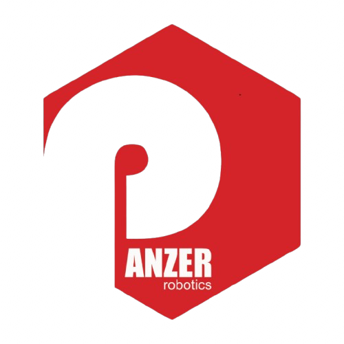
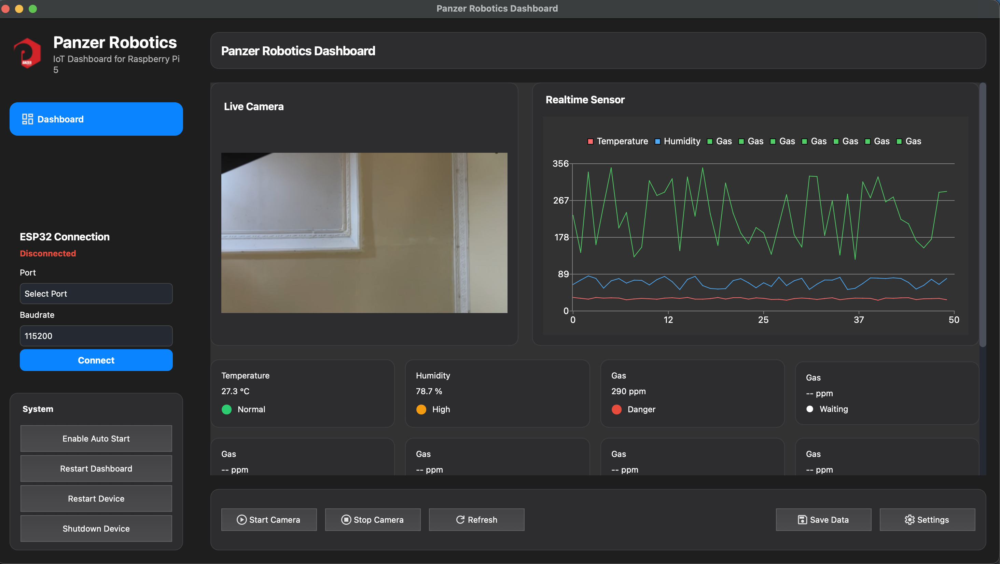

#  Panzer Robotics Dashboard
Modern Desktop Dashboard for Raspberry Pi, ESP32, and IoT Devices built with **Python + PySide6**.


---

# Features

- 🎥 Live Camera Preview
- 📈 Real-time Sensor Monitoring
- 📊 Live Sensor Chart
- 💡 Device Control (Relay, Lamp, Motor, etc.)
- 🔌 Serial Communication (ESP32)
- 📱 Responsive UI
- 🌙 Dark Theme
- ⚙ JSON Based Configuration
- 🔄 Modular Component System

---

# Screenshot



---

# Project Structure

```
raspi-dashboard/
│
├── assets/
│
├── config/
│   ├── app.json
│   ├── control.json
│   ├── sensor.json
│   ├── serial.json
│   └── theme.json
│
├── core/
│   ├── config_manager.py
│   ├── responsive.py
│   ├── serial_manager.py
│   ├── dummy_data.py
│   └── ...
│
├── screens/
│   ├── main_window.py
│   └── sidebar/
│       ├── dashboard.py
│       ├── camera.py
│       ├── control.py
│       ├── sensor.py
│       └── settings.py
│
├── widgets/
│   ├── card.py
│   ├── sensor_card.py
│   ├── control_card.py
│   ├── camera_preview.py
│   ├── dashboard_toolbar.py
│   ├── sidebar.py
│   └── ...
│
├── main.py
└── README.md
```

---

# Requirements

Python

```
Python 3.10+
```

Packages

```
PySide6
opencv-python
pyserial
numpy
matplotlib
```

Install

```
pip install -r requirements.txt
```

---

# Run

```
python main.py
```

---

# Configuration

Semua konfigurasi berada pada folder

```
config/
```

## app.json

Mengatur ukuran window dan identitas aplikasi.

```
{
  "windowTitle": "...",
  "windowWidth": 1400,
  "windowHeight": 800
}
```

---

## sensor.json

Daftar sensor yang akan dibuat otomatis.

```
{
    "cards":[
        {
            "key":"temperature",
            "title":"Temperature",
            "unit":"°C"
        }
    ]
}
```

---

## control.json

Daftar tombol/switch yang dibuat otomatis.

```
{
    "cards":[
        {
            "key":"lamp",
            "title":"Lamp",
            "type":"switch",
            "default":false
        }
    ]
}
```

---

# Component System

Dashboard menggunakan sistem component sehingga hampir semua widget dibuat secara otomatis dari JSON.

---

# Sensor Card

Component

```
widgets/sensor_card.py
```

Contoh

```
SensorCard(
    title="Temperature",
    value="25",
    unit="°C"
)
```

Hasil

```
Temperature

25°C

● Normal
```

---

# Control Card

Component

```
widgets/control_card.py
```

Support

- Switch
- Button

Contoh Switch

```
{
    "key":"lamp",
    "title":"Lamp",
    "type":"switch"
}
```

Contoh Button

```
{
    "key":"restart",
    "title":"Restart ESP32",
    "type":"button",
    "text":"Restart"
}
```

---

# Card

Semua component menggunakan

```
widgets/card.py
```

Sehingga style seluruh dashboard konsisten.

---

# Responsive

Project memiliki responsive manager

```
core/responsive.py
```

Digunakan untuk

- Sidebar Width
- Logo Size
- Font
- Button Height
- Menu Height

Contoh

```
Responsive.sidebar_width()

Responsive.logo_size()

Responsive.title_font()
```

---

# Serial Communication

Semua komunikasi menggunakan JSON.

Contoh

```
{
    "type":"control",
    "key":"lamp1",
    "value":true
}
```

Button

```
{
    "type":"button",
    "key":"restart"
}
```

ESP32 cukup membaca JSON tersebut.

---

# Menambah Sensor Baru

1.

Buka

```
config/sensor.json
```

Tambah

```
{
    "key":"soil",
    "title":"Soil Moisture",
    "unit":"%"
}
```

2.

Dashboard otomatis membuat card.

3.

Update nilai

```
update_card(
    "soil",
    65,
    "Normal"
)
```

Selesai.

---

# Menambah Control Baru

Buka

```
config/control.json
```

Tambah

```
{
    "key":"fan",
    "title":"Cooling Fan",
    "type":"switch"
}
```

atau

```
{
    "key":"restart",
    "title":"Restart",
    "type":"button",
    "text":"Restart ESP32"
}
```

Dashboard otomatis membuat component.

---

# Menambah Halaman Baru

Misalnya

```
screens/sidebar/log.py
```

Kemudian

```
page = LogPage()

self.add_page(
    "log",
    page
)
```

Tambahkan button pada Sidebar.

```
self.logButton = QPushButton("Log")
```

Lalu

```
navigation = {
    self.logButton:"log"
}
```

Selesai.

---

# Menambah Widget Baru

Misalnya ingin membuat Gauge.

Buat

```
widgets/gauge_card.py
```

```
class GaugeCard(Card):
    ...
```

Kemudian panggil pada halaman Dashboard.

---

# Menambah Config Baru

Misalnya

```
config/mqtt.json
```

Lalu

```
Config.get(
    "mqtt",
    "host"
)
```

---

# Dashboard Flow

```
main.py
        │
        ▼
MainWindow
        │
        ▼
Dashboard
        │
        ├──────── CameraPreview
        │
        ├──────── SensorChart
        │
        ├──────── SensorCard
        │
        ├──────── ControlCard
        │
        └──────── Toolbar
```

---

# Serial Flow

```
ESP32
      ▲
      │ JSON
      │
SerialManager
      ▲
      │
Dashboard
      ▲
      │
ControlCard
```

---

# Theme

Style berada pada

```
theme.json
```

Semua widget menggunakan objectName sehingga mudah di-custom.

---

# Service

```commandline
assets/systemd/panzer-dashboard.service
```

isi

```
[Unit]
Description=Panzer Robotics Dashboard
After=network.target

[Service]
Type=simple

WorkingDirectory=/home/pi/Panzer/raspi-dashboard

ExecStart=/usr/bin/python3 /home/pi/Panzer/raspi-dashboard/main.py

Restart=always
RestartSec=5

User=pi

Environment=DISPLAY=:0
Environment=XAUTHORITY=/home/pi/.Xauthority

[Install]
WantedBy=multi-user.target
```

ketika pertama kali dilakukan 
```
sudo cp assets/systemd/panzer-dashboard.service /etc/systemd/system/

sudo systemctl daemon-reload

sudo systemctl enable panzer-dashboard
```

# Roadmap

- MQTT
- WebSocket
- Modbus RTU
- Modbus TCP
- Camera Recording
- AI Object Detection
- Face Recognition
- OTA ESP32
- Raspberry GPIO
- Plugin System
- Multi Camera
- Multi ESP32
- ROS2 Integration

---

Copyright 2026 Panzer Robotics